<p align="center">
  
</p>

<h1 align="center">Extreme InfiniTV</h1>

<p align="center"><strong>A cross-platform IPTV player for Xtream Codes and M3U / M3U8 playlists.</strong></p>

<p align="center">
  Live TV with EPG, movies, series, offline downloads, and TV-remote (D-pad) navigation.<br/>
  Ships on Windows (Microsoft Store + installer), Android phone / tablet / TV (Google Play), macOS, Linux, and the web.
</p>

<p align="center">
  <a href="https://apps.microsoft.com/detail/9NN162Z0WXSR">
    
  </a>
  <a href="https://play.google.com/store/apps/details?id=com.infinitel8p.xtream">
    
  </a>
  <a href="https://github.com/infinitel8p/Extreme-InfiniTV/releases/latest">
    
  </a>
</p>

<p align="center">
  <a href="https://github.com/infinitel8p/Extreme-InfiniTV/releases/latest"></a>
  <a href="https://github.com/infinitel8p/Extreme-InfiniTV/releases"></a>
  <a href="https://github.com/infinitel8p/Extreme-InfiniTV/stargazers"></a>
  
</p>

## Screenshots

<p align="center">
  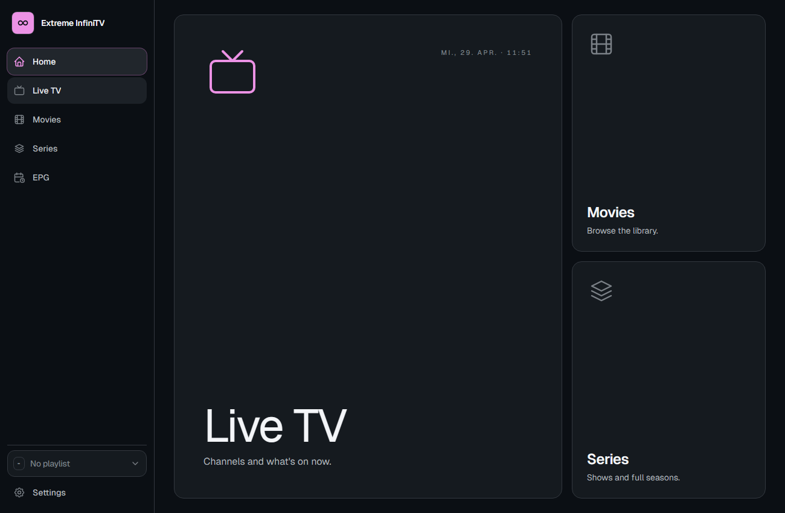
</p>

<details>
<summary>More screenshots (Live TV, EPG, Movies, Series, Android TV, mobile)</summary>

**Desktop**

| | | |
|---|---|---|
| 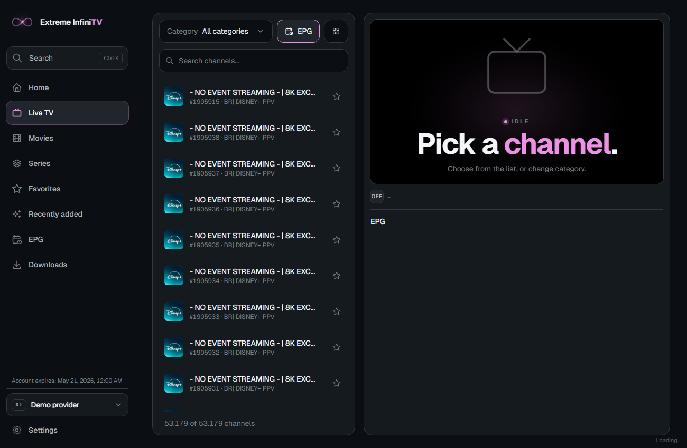 | 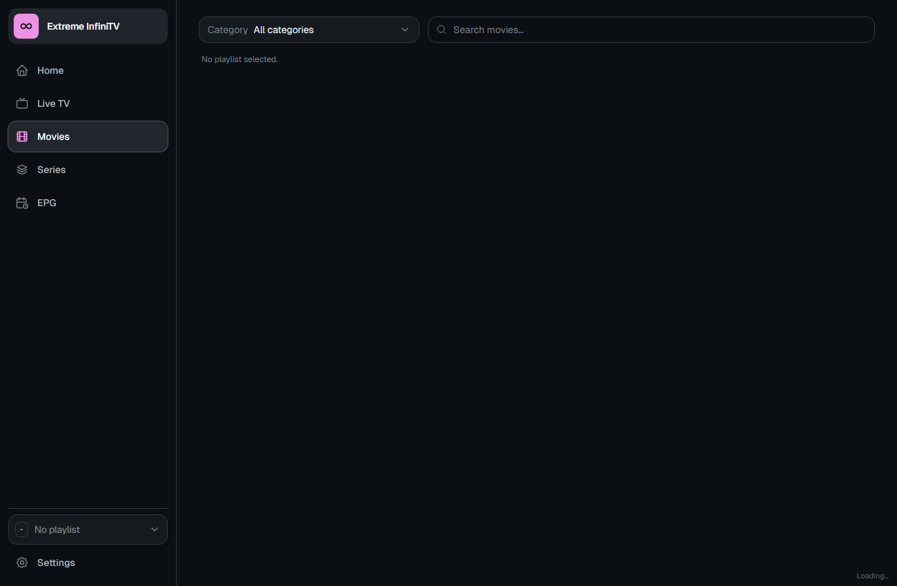 | 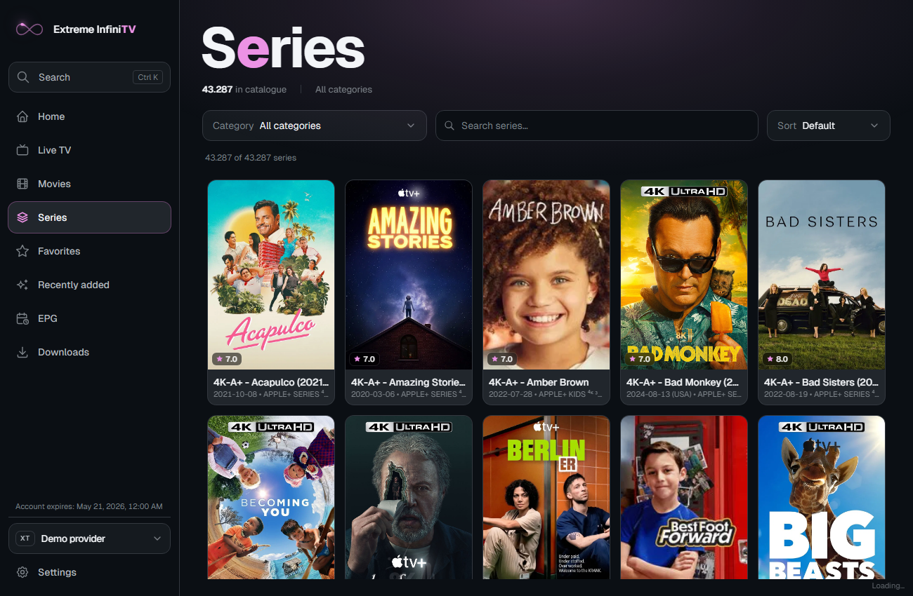 |
| 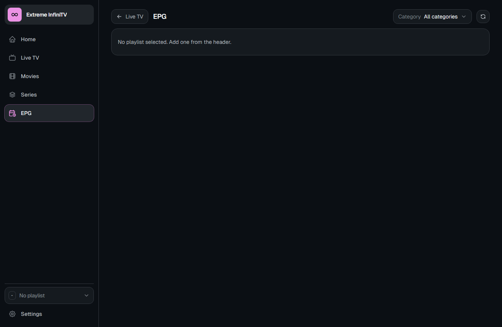 | 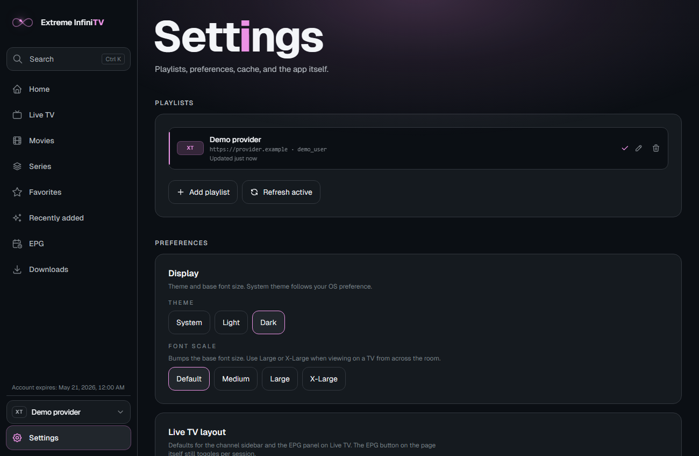 | 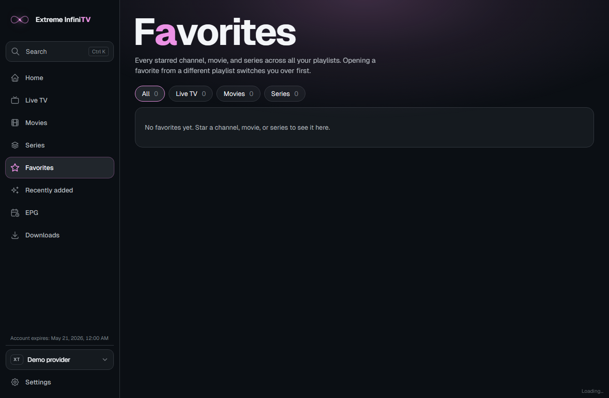 |

**Android TV (10-foot UI, D-pad focus)**

| | | |
|---|---|---|
| 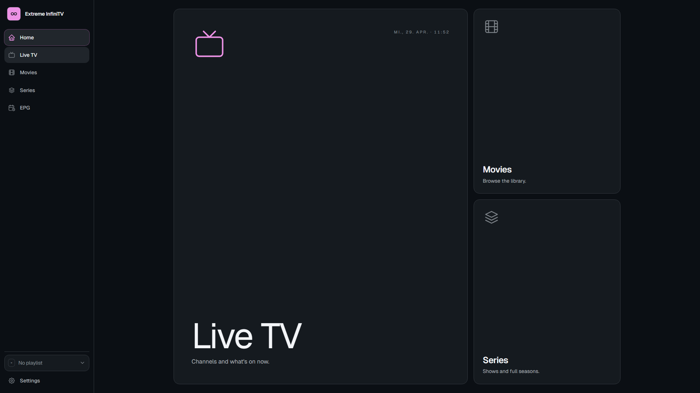 | 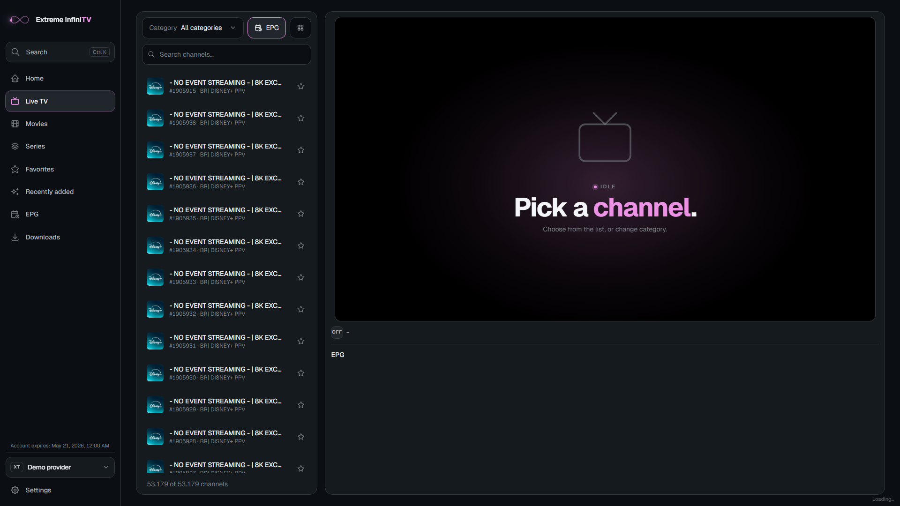 | 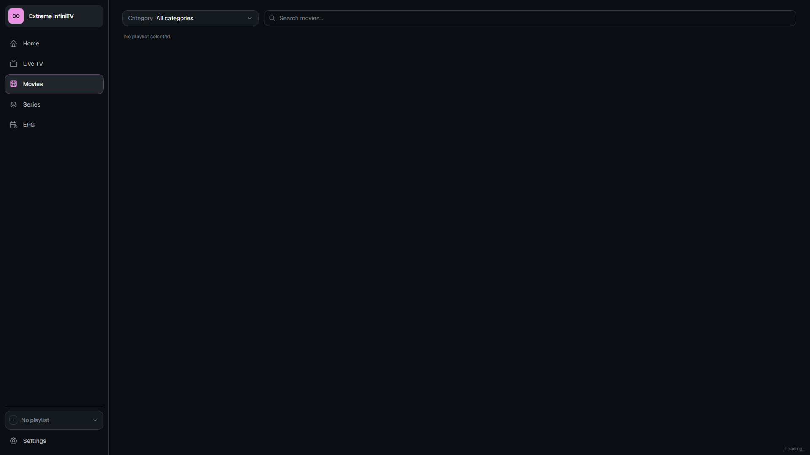 |

**Phone (portrait, touch)**

| | | |
|---|---|---|
| 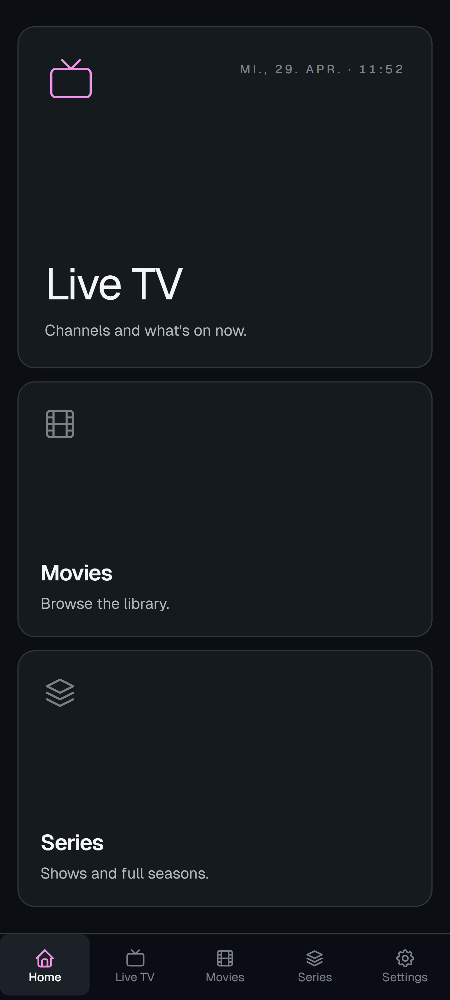 | 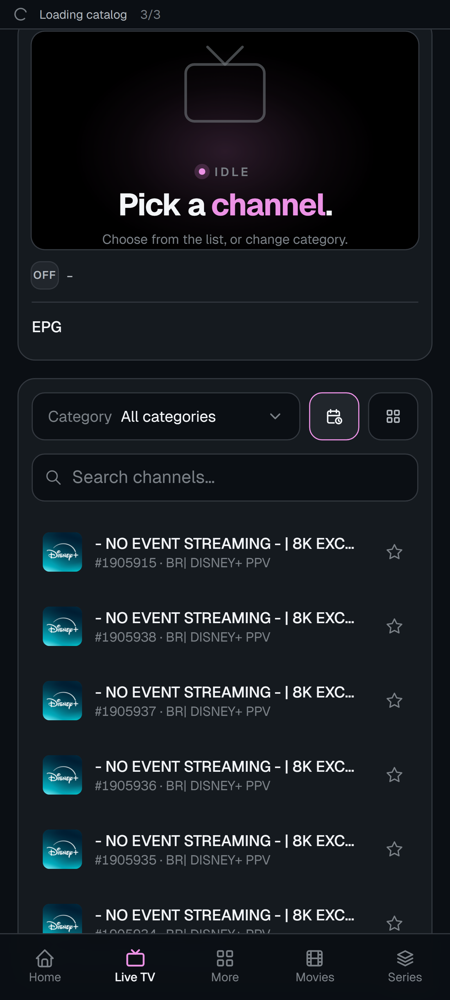 | 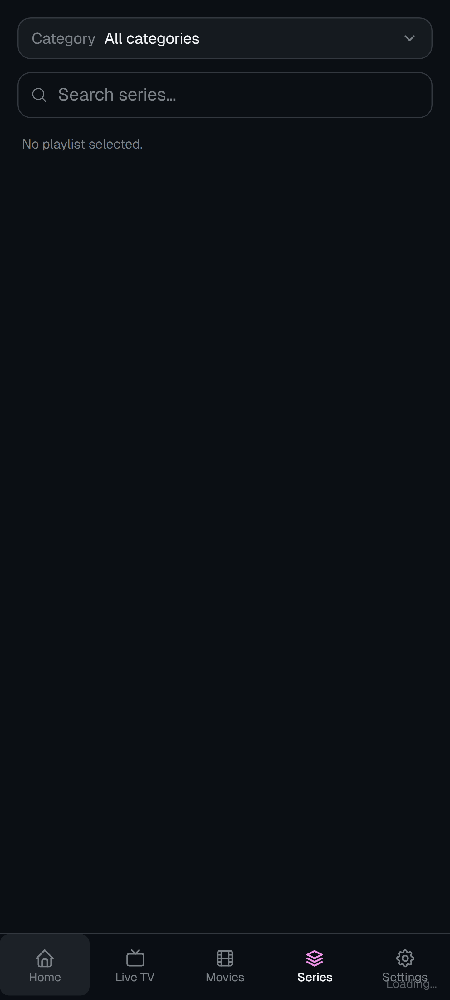 |

</details>

## Features

- **Two backends, one UI.** Sign in with Xtream Codes credentials (host / port / user / pass) or paste a direct `.m3u` / `.m3u8` URL. The app detects the mode automatically.
- **Live TV** with category filtering, channel search, virtualised list, and inline EPG (now / next / today).
- **Movies (VOD)** and **Series** library with poster grids, detail dialogs, and season / episode navigation.
- **Full schedule grid** on the EPG page, with timezone-aware "all times local" rendering.
- **Picture-in-picture** and a Video.js-powered player tuned for HLS.
- **Multiple playlists**, switchable from the sidebar without re-entering credentials.
- **TV-first navigation.** Spatial focus (D-pad / arrow keys) is wired across the whole app via `spatial-navigation-polyfill`. Hit targets, focus rings, and reflow tested for 10-foot UI.
- **Light and dark themes**, both first-class. Honours `prefers-color-scheme`, `prefers-reduced-motion`, and `prefers-contrast`.
- **Adjustable font scale** (Default / Medium / Large / X-Large) plus a responsive root size that scales the whole UI on 4K and 8K displays.
- **Self-updating Windows desktop build** via the Tauri updater (signed with minisign, served from GitHub Releases).
- **Offline-friendly persistence.** Credentials and preferences live in the OS app-data dir on Tauri builds, with a localStorage / cookie fallback on the web build.

## Install

| Platform | How | Updates |
| --- | --- | --- |
| Windows (Microsoft Store) | [apps.microsoft.com](https://apps.microsoft.com/detail/9NN162Z0WXSR) | Microsoft Store |
| Windows (sideload) | NSIS `.exe` (or `.msi`) from [Releases](https://github.com/infinitel8p/Extreme-InfiniTV/releases/latest) | In-app auto-updater |
| macOS (Apple Silicon + Intel) | Universal `.dmg` from [Releases](https://github.com/infinitel8p/Extreme-InfiniTV/releases/latest) | In-app auto-updater |
| Linux (Debian / Ubuntu / Mint) | `.deb` from [Releases](https://github.com/infinitel8p/Extreme-InfiniTV/releases/latest) | Manual |
| Linux (Fedora / openSUSE / RHEL) | `.rpm` from [Releases](https://github.com/infinitel8p/Extreme-InfiniTV/releases/latest) | Manual |
| Linux (any distro, portable) | `.AppImage` from [Releases](https://github.com/infinitel8p/Extreme-InfiniTV/releases/latest) | In-app auto-updater |
| Android phone / tablet | [Google Play](https://play.google.com/store/apps/details?id=com.infinitel8p.xtream) | Play Store |
| Android TV | Same APK, sideload via ADB or use Play Store on supported devices | Play Store |
| Web preview | Build with `pnpm build` and serve `dist/` (no auto-update, no native features) | Manual |

### via winget

The Microsoft Store listing is federated through `winget`, so you can install without opening the Store:

```powershell
winget install --id 9NN162Z0WXSR --source msstore
```

### macOS: "Extreme InfiniTV.app" cannot be opened

The macOS build is not yet notarized by Apple, so Gatekeeper blocks it on first launch with a message like _"Apple could not verify Extreme InfiniTV.app is free of malware"_. After dragging the app from the `.dmg` into `/Applications`, remove the quarantine flag from a Terminal:

```bash
xattr -dr com.apple.quarantine "/Applications/Extreme InfiniTV.app"
```

Then open the app normally. You only need to do this once per install.

## Develop

Requirements: [pnpm](https://pnpm.io) (the package manager is pinned in `package.json`), Node 20+, the Rust toolchain (only for `tauri` commands), and Android Studio for `tauri:android`.

```bash
pnpm install
pnpm dev                  # Astro + Svelte at http://localhost:4321
pnpm tauri dev            # Native Windows / desktop shell (auto-spawns pnpm dev)
pnpm tauri:android        # Android dev shell
```

The Astro dev server's HMR `host` is hardcoded to a LAN IP in `astro.config.mjs`. Update or remove that block if dev HMR fails on your machine.

There are no tests, linters, or formatters configured. TypeScript is in strict mode (`tsconfig.json` extends `astro/tsconfigs/strict`); the `@/*` alias maps to `src/*`.

## Credits

Copyright (c) 2025 Ludovico Ferrara.
